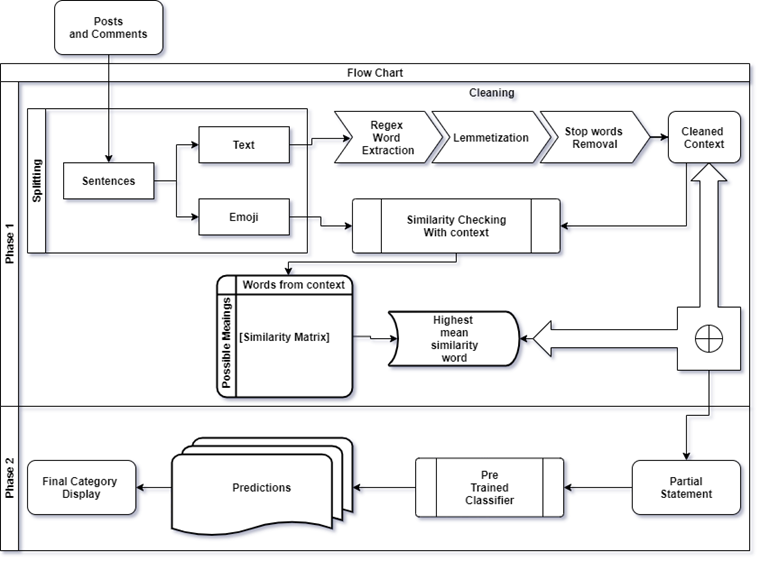
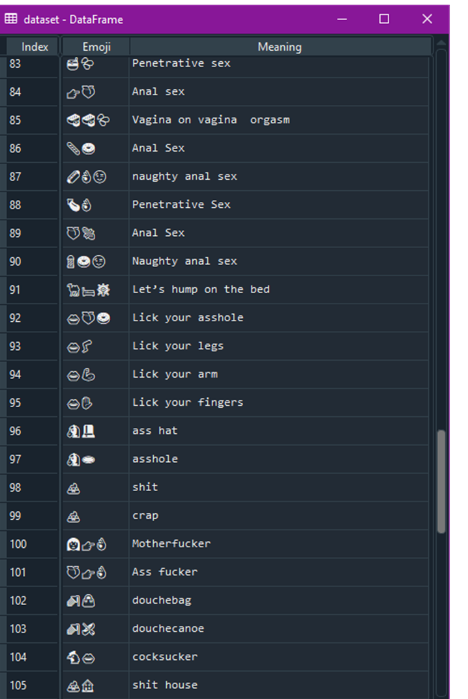
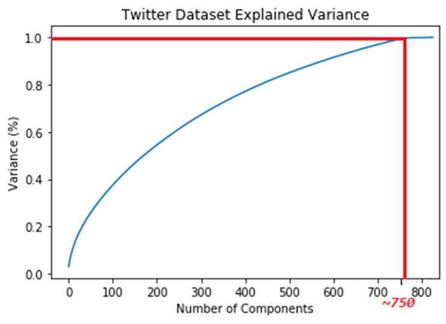
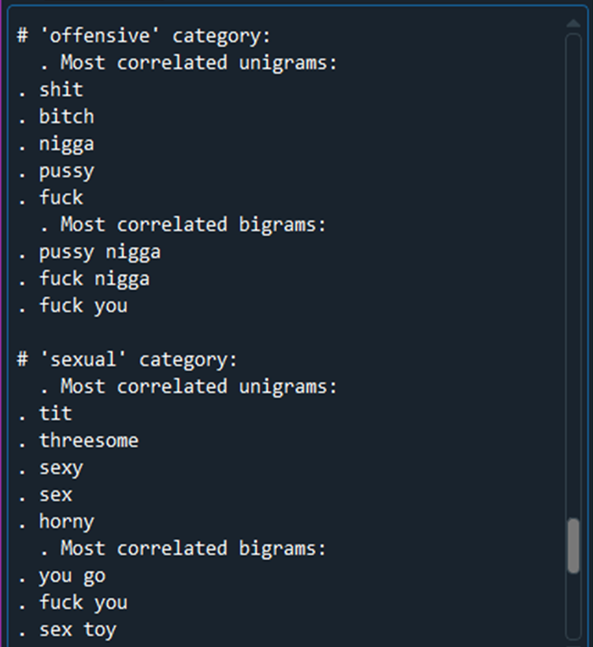
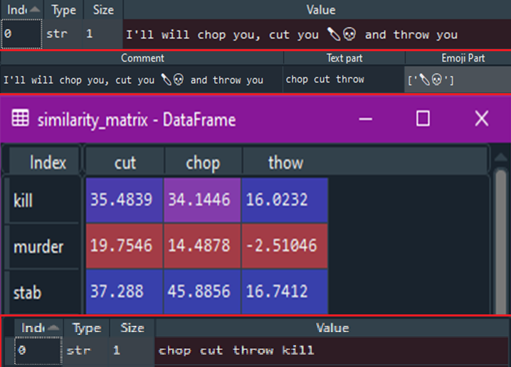
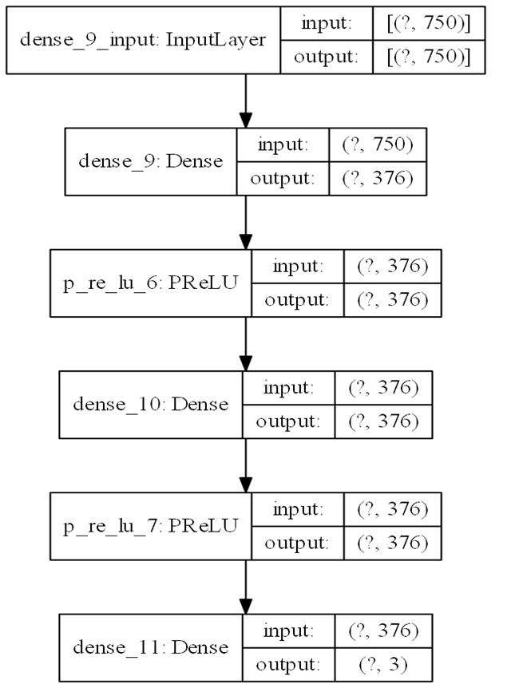
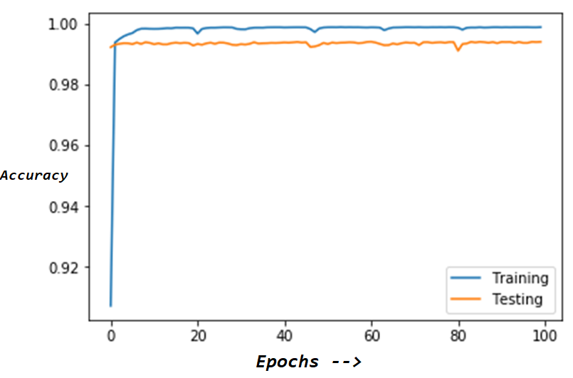
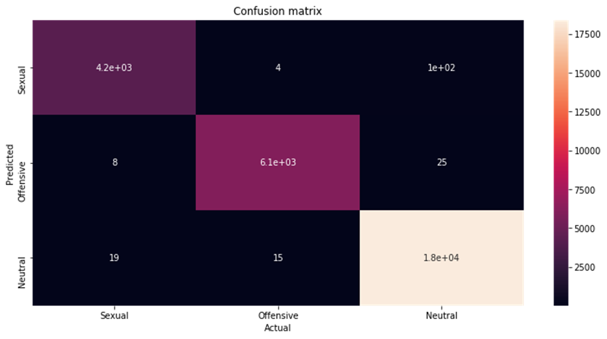
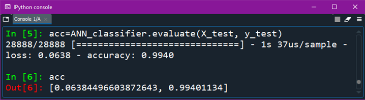
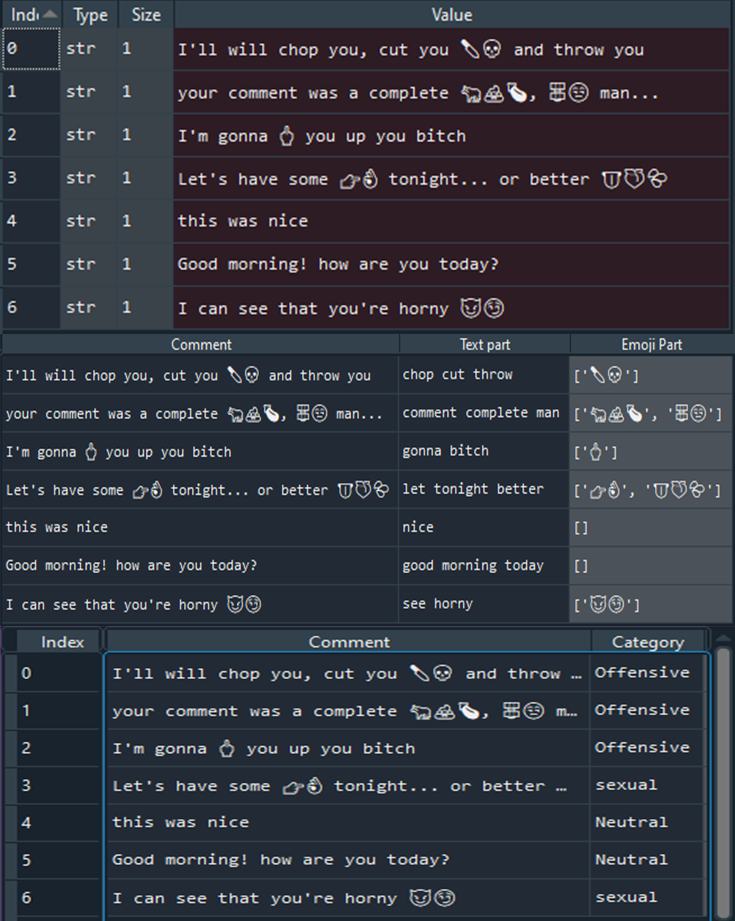

# Emoji-Classification

Before proceeding, I'd like you to have a read though this [article](https://gulfnews.com/lifestyle/fb-instagram-ban-eggplant-peach-as-sexual-emojis-1.1572411550840).

So basically, this project is an approach to detect emojis or strings of emojis that has been used in a sexual or offensive manner.

 
 

To do so, an hierarchical lookup data structure, called the `Emoji-Net`, is created to store and store and retrieve all the emoji and their meanings in single or string form. The Structure is in `Emoji Net.py`

Project Structure:

* Datasets:
 * [Emoji Dataset](Emoji%20Dataset.xlsx), `Columns --> [Emoji Strings, Descrption]`
 
 
 
 * [Twitter Dataset](TweetDataset/Dataset.xlsx), `Columns --> [Category, Comment, Words resulting in the category]`
 
 >For the twitter dataset, you can collect it using Twitter API and projects like [this one](https://github.com/Jefferson-Henrique/GetOldTweets-python). 
 >Use the `Feature Extraction.py` to clean and extract the data. Here we' have used TFID to generate the features and PCA for dimentionality reduction.
 
 

>For our case, we used 750 as our number of features.

A basic chi square test revals the same:

 
 
 
 * Emoji Net:
  1. Preparing the Emoji Net using the Emoji Dataset to create the above mentioned data stracture.
  
     >Use the `ENCreator.py` to generate a picle file that contains the Emoji Net from the.
     
  2. Use the Emoji Net to convert strings of emojis and tried to find the best similarity with their context
     
     >`ENParser.py` Accepts a String with the strings of emojis to get the similarity
     
 

 * ANN Classifier
 >Use the `ANN TF Classifier` to train the model
 
  1. Architecture
  
   
  
  2. Training & Evaluation:
  
   
  
  
  
   
 
 * Finall Pediction:
   This is the final stage where we use random comments off the internet and put it to test it against the classifier.
   We use the `Emoji Classification Driver.py` to test our system by putting the comments in a list and running the entire code.
   
    
   
   Results look pretty accurate.
  
